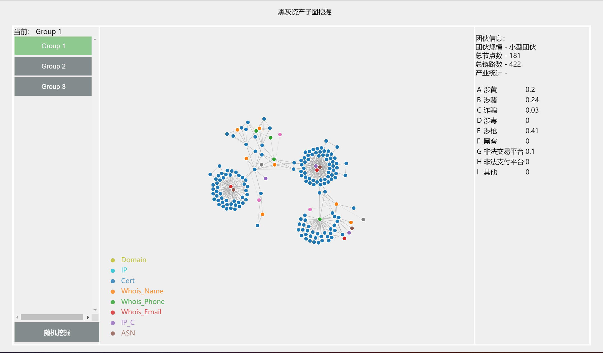
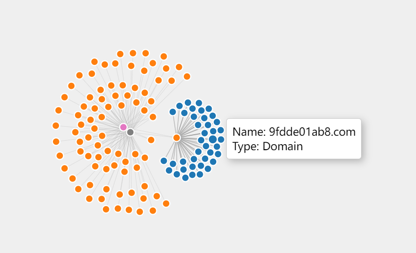
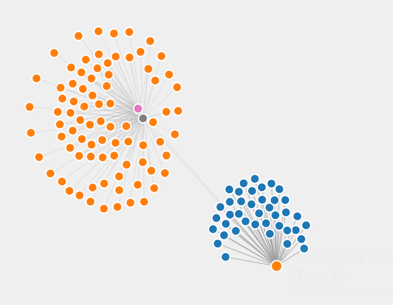
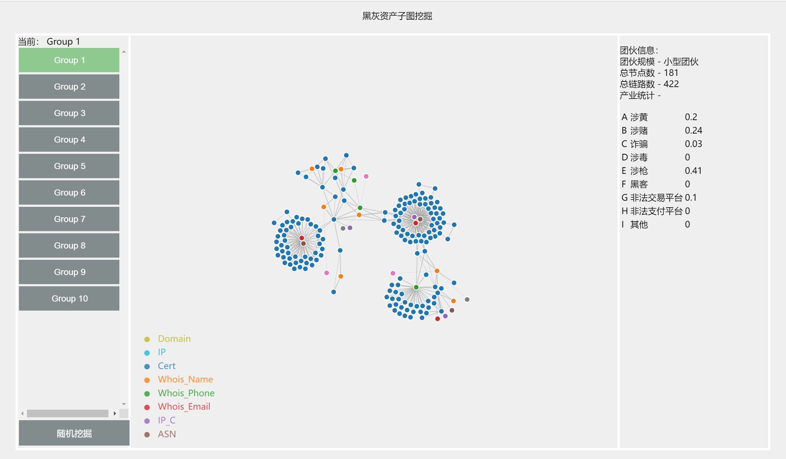
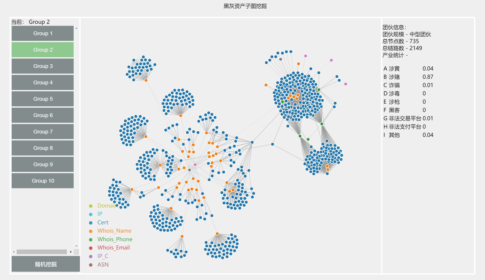
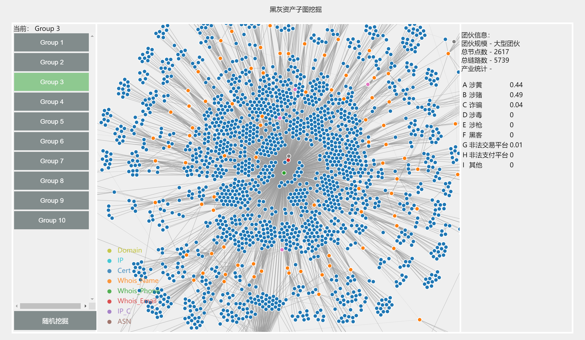

# 黑灰产网络资产图谱可视分析

<table style="border:none">
    <tr>
        <td>邵 诣</td>
        <td></td>
        <td>吕昕凯</td>
    </tr>
    <tr>
        <td>大数据学院</td>
        <td></td>
        <td>大数据学院</td>
    </tr>
    <tr>
        <td>19307130113@fudan.edu.cn</td>
        <td></td>
        <td>19300180115@fudan.edu.cn</td>
    </tr>
</table>

## 任务综述

为了更好地协助治理打击黑灰产团伙掌握地网络资产，我们以提供的黑灰产网络资产图谱数据集为基础，设计了一可视化方案，来从数据集中挖掘脱衣黑灰产团伙掌握地网络资产，并识别该子图中的核心资产与关键链路。

在设计可视化系统地时候，我们采用了前端Vue + D3，后端Python & Flask的方式来实现，在后端处理好数据后通过Flask的接口以json的格式将数据流传递给前端，前端也可以通过向Flask发送请求来调用后端函数处理数据。

## 使用说明

需要先从https://github.com/csuvis/CyberAssetGraphData 下载`Link.csv`以及`Node.csv`，并放到data文件夹下。而后直接运行`app.py`，即可在http://localhost:5000 看见我们的系统。

## 前端可视化部分

### 系统介绍

如图，为我们的可视化界面

我们的可视化系统主要分为三部分。左侧列表中的按钮可以选择展示第几组的数据，左侧下方的“随机挖掘”按钮，点击后将调用后端的python函数，随机选择一个点并以其为初始点挖掘子图。挖掘后的子图将别加入到上方的列表，并自动选中在右侧展示。

右侧中间部分是我们的力导向图，用不同的颜色区分不同类型的节点，并用边的长短来区分边的重要性，越短的边越重要。其中，点可以通过拖拽改变位置，鼠标悬浮到点上的时候也会展示该节点的相关信息，如下图

<table>
    <tr>
        <th>悬停</th>
        <th>拖拽</th>
    </tr>
	<tr>
        <td>
            
		</td>
		<td>
            
        </td>
    </tr>
</table>
右侧的信息栏展示了节点的基本信息，关于团伙规模以及各个产业的百分比，其中，产业百分比由后端传入数据之后在前端计算得出。

### 挖掘发现

#### 有线索的挖掘

通过对提供的线索进行挖掘，我们可以得到如下结果：

虽然对于线索3中的大型团伙的展示效果不是很好，但通过直观观察这三个团伙的结构特征，我们不难发现，其中有很多一个IP节点连接多个Domain节点的结构特征。这一特点在后面的随即挖掘部分中也有观察到。经过我们小组的讨论分析，认为其基本符合目前大多数网站的特征，在一个服务器上渲染不同的网页，并通过不同的域名分发出去，这种方法可以很大程度上提高服务器的利用率。

此外，我们还发现，一些团伙主要涉及一个或两个产业，比如团伙1以涉枪为主，

## 子图挖掘算法部分

