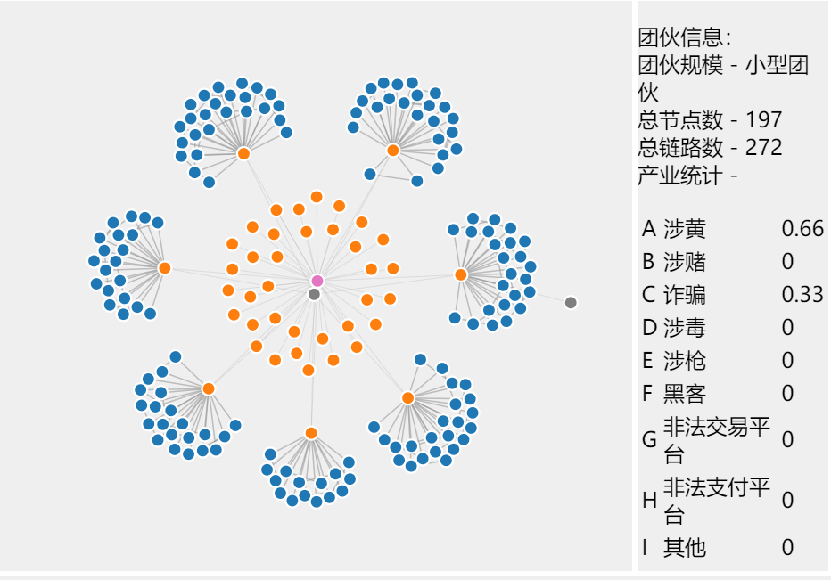
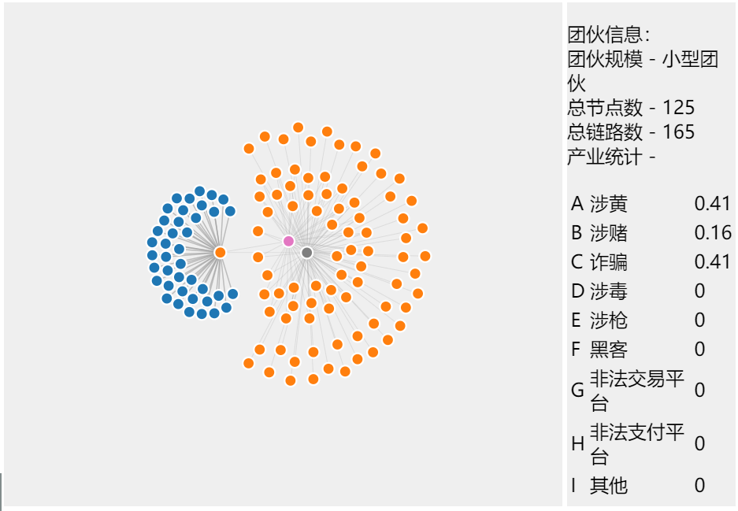
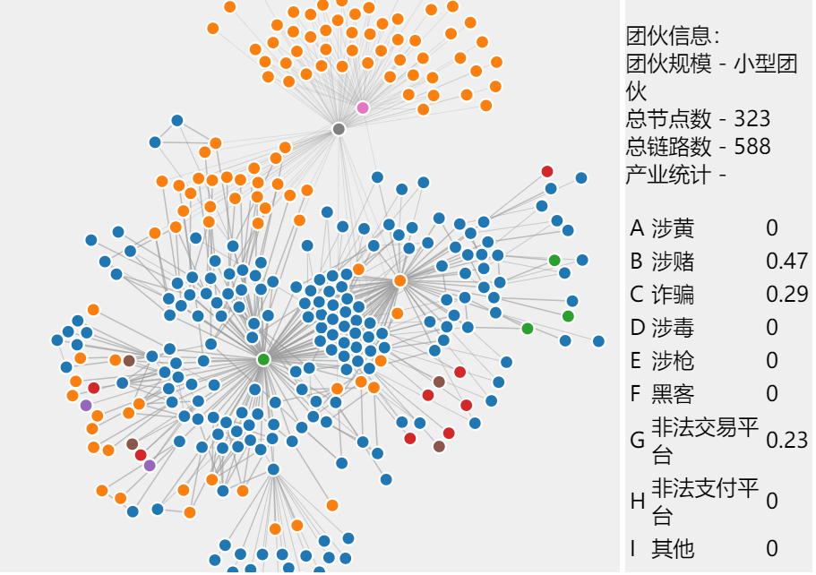
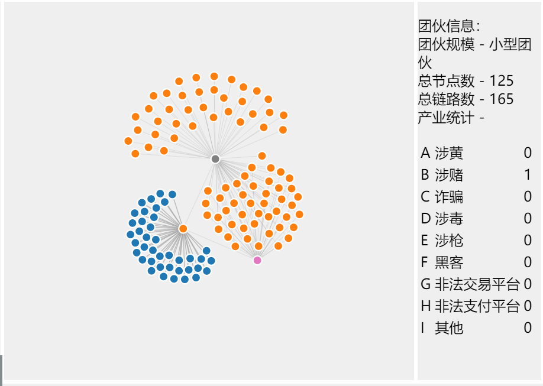
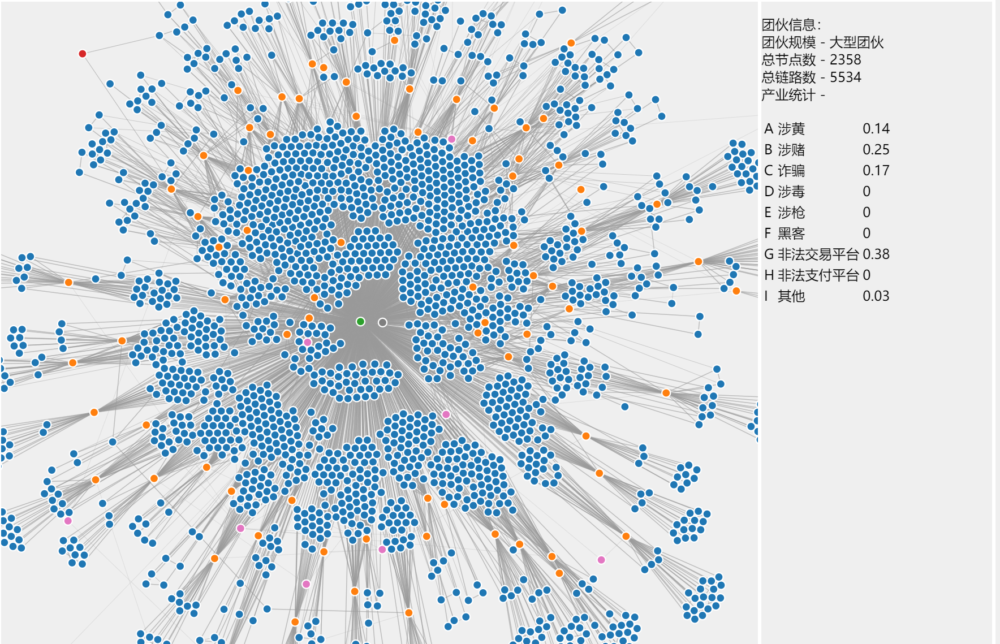

# 黑灰产网络资产图谱可视分析

<table style="border:none">
    <tr>
        <td>邵 诣</td>
        <td></td>
        <td>吕昕凯</td>
    </tr>
    <tr>
        <td>大数据学院</td>
        <td></td>
        <td>大数据学院</td>
    </tr>
    <tr>
        <td>19307130113@fudan.edu.cn</td>
        <td></td>
        <td>19300180115@fudan.edu.cn</td>
    </tr>
</table>

## 任务综述

为了更好地协助治理打击黑灰产团伙掌握地网络资产，我们以提供的黑灰产网络资产图谱数据集为基础，设计了一可视化方案，来从数据集中挖掘脱衣黑灰产团伙掌握地网络资产，并识别该子图中的核心资产与关键链路。

在设计可视化系统地时候，我们采用了前端Vue + D3，后端Python & Flask的方式来实现，在后端处理好数据后通过Flask的接口以json的格式将数据流传递给前端，前端也可以通过向Flask发送请求来调用后端函数处理数据。

## 使用说明

需要先从https://github.com/csuvis/CyberAssetGraphData 下载`Link.csv`以及`Node.csv`，并放到data文件夹下。而后直接运行`app.py`，即可在http://localhost:5000 看见我们的系统。

## 前端可视化部分

### 系统介绍

如图，为我们的可视化界面


我们的可视化系统主要分为三部分。左侧列表中的按钮可以选择展示第几组的数据，左侧下方的“随机挖掘”按钮，点击后将调用后端的python函数，随机选择一个点并以其为初始点挖掘子图。挖掘后的子图将别加入到上方的列表，并自动选中在右侧展示。

右侧中间部分是我们的力导向图，用不同的颜色区分不同类型的节点，并用边的长短来区分边的重要性，越短的边越重要。其中，点可以通过拖拽改变位置，鼠标悬浮到点上的时候也会展示该节点的相关信息，如下图

<table>
    <tr>
        <th>悬停</th>
        <th>拖拽</th>
    </tr>
	<tr>
        <td>
            
		</td>
		<td>
            
        </td>
    </tr>
</table>
右侧的信息栏展示了节点的基本信息，关于团伙规模以及各个产业的百分比，其中，产业统计部分考虑了团伙中每个Domain节点涉及的黑灰产业，由后端传入数据之后在前端计算得出其占团伙总涉及黑灰产业的百分比。

### 挖掘发现

利用我们的可视化系统对数据进行挖掘，我们可以发现关于黑灰产业的一些重要信息。

#### 有线索的挖掘

通过对提供的线索进行挖掘，我们可以得到如下结果：


<center>线索1</center>


<center>线索2</center>


<center>线索3</center>

虽然对于线索3中的大型团伙的展示效果不是很好，但通过直观观察这三个团伙的结构特征，我们不难发现，其中有很多一个IP节点连接多个Domain节点的结构特征。这一特点在后面的随即挖掘部分中也有观察到。经过我们小组的讨论分析，认为其基本符合目前大多数网站的特征，在一个服务器上渲染不同的网页，并通过不同的域名分发出去，这种方法可以很大程度上提高服务器的利用率。

此外，我们还发现，一些团伙主要涉及一个或两个产业，比如团伙1以涉枪为主，还涉嫌一些涉赌成分；团伙2以涉赌为主，并涉及少量其它黑灰产业；团伙3以涉黄和涉赌为主。

#### 无线索随机挖掘

利用随机挖掘功能，我们可以在网络中进行随机探索

<table>
    <tr>
        <td>
        
        </td>
        <td>
        
        </td>
    </tr>
    <tr>
        <td>
        
        </td>
        <td>
        
        </td>
    </tr>
</table>

<center>挖掘到的四个小型团伙</center>



<center>挖掘到的一个大型团伙</center>

如上图，为我们随机探索的结果。其中因为探索到的小型团伙数量比较多，故只选取了其中四个展示。在挖掘到许十几个个小型团伙之后，我们挖掘到了一个大型团伙。从这个过程中，也可以大致看出整体数据的团伙分布：以小型团伙居多，还有一些中型团伙以及大型团伙。

团伙的结构主要有“IP - 多个Domain”以及“ASN - 多个IP”， “IP_C - 多个IP”。且大多呈现聚簇分布，特点比较明显。

从团伙的产业结构我们也可以看出，网络上的小型黑灰团伙主要以涉黄，涉赌，诈骗为主。有少数涉及非法交易平台。而中型大型团伙则会较多涉及非法交易平台，这可能是因为我国对于非法交易平台的监管比较严格，同时这个平台也不是很能吸引到相应的黑灰消费者。团伙基本都是基于“黄赌骗”这三个非法业务为主发展。

## 子图挖掘算法部分

子图挖掘后端部分我们基于深度优先实现层级搜索，用于模拟在节点之间根据边的重要程度进行不同深度的跳转。同时每进入一个新节点时，我们都会依据节点连接特性，根据业务规则来判断该节点是否属于核心资产，并进行标记。最后，可视化的节点筛选功能也是在这里实施的，为减前端渲染压力，我们在此对具有重复邻居的超级节点进行精简，以减少其可视化展示的邻居节点数量，从而提高展示性能。但这个处理过程也带来了一些坏处，例如我们前端展示的团伙统计信息是基于接收到的节点进行的，因而筛选会导致统计信息不完全，这点我们将在之后进行改进。

下面是核心算法部分。

```python
# BFS search
stack = deque([id])
level = 0  # level < mining_depth
while stack:
    for _ in range(len(stack)):
        node_id = stack.popleft()

        # get all neighbors
        neighbors = list(graph_all.neighbors(node_id))  # 迭代器转为list，重复遍历
        # judge if is core node
        if graph_all.nodes[node_id]['importance'] == 3:
            if len(neighbors) >= min_num_edges:
                weak_edges = 0  # 50%以上的邻边关联强度较弱的网络资产不被认为是核心网络资产
                num_ip = 0  # 同时关联2个以上IP地址的Domain网络资产不被认为是核心网络资产
                for neighbor in neighbors:
                    if graph_all.nodes[neighbor]['type'] == 'IP':
                        num_ip += 1
                    if graph_all.edges[node_id, neighbor]['importance'] == 1:
                        weak_edges += 1

                if num_ip < 2 and weak_edges / len(neighbors) < 0.5:  # 核心资产
                    graph_all.nodes[node_id]['is_core_node'] = True

        # visualize the subgraph
        num_neighbors = 0  # if num > max_num_neighbors, stop
        for neighbor in neighbors:
            if neighbor not in subgraph_id:
                subgraph_id.add(neighbor)
                graph_all.nodes[neighbor]['classified'] = True  # 分到一个group里
                stack.append(neighbor)
                num_neighbors += 1

            if num_neighbors > max_num_neighbors:
                break
```

## 未来改进

黑灰产网络资产信息的挖掘、可视化需求仍有提升空间，在本次信息系统的实现中，我们为增加网页渲染效率进行了部分对数据造成影响的优化，在与老师交流后探讨了更佳的解决方案，将其列为未来改进：

1. 改变前后端分离的运行模式，将部分信息计算置于前端进行，增加交互体验，方便用户使用可视化系统进行数据分析，同时充分发挥d3的潜力。
2. 在简化超级节点时，将邻居节点真实数据纳入团伙涉足黑产统计，确保统计信息的准确性。
3. 目前前端视图仍存在超出可视框，需要用户左右拖拽来查看全览的问题，在老师的指导下，我们对力的实现方式加入了一些改动，让图像更加易于观察。在后面的工作中，我们会考虑实现缩放功能，以及在可视框边缘做一些处理，将展示图限制在可视范围内。
4. 对于一些度数为1的节点，可以考虑将其合并到其唯一的邻居节点之上，这样可以很大程度上降低图的复杂性，同时也会降低浏览器渲染的压力。
5. 今后考虑对整体数据做一个深层挖掘，简要分析其中的团伙构成成分，以便更好地提取团伙特征以及区分团伙。


