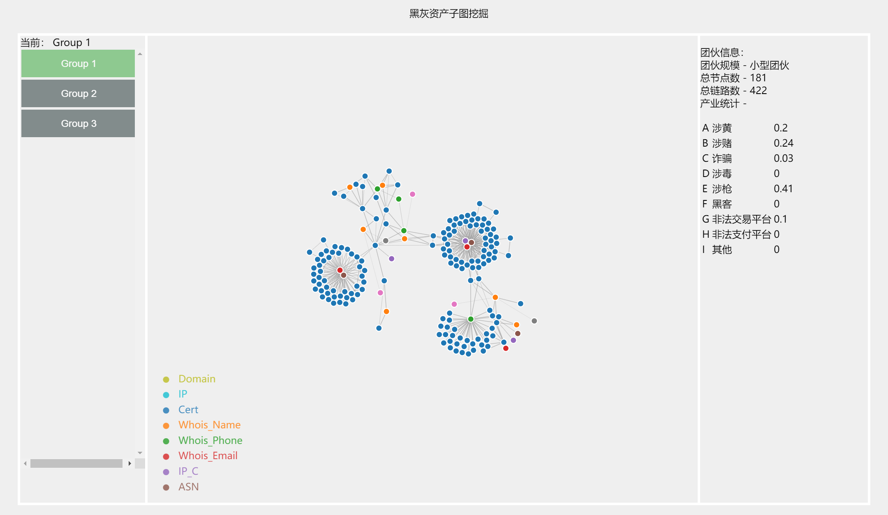

# 黑灰产网络资产图谱可视分析

<table style="border:none">
    <tr>
        <td>邵 诣</td>
        <td></td>
        <td>吕昕凯</td>
    </tr>
    <tr>
        <td>大数据学院</td>
        <td></td>
        <td>大数据学院</td>
    </tr>
    <tr>
        <td>19307130113@fudan.edu.cn</td>
        <td></td>
        <td>19300180115@fudan.edu.cn</td>
    </tr>
</table>

## 任务综述

为了更好地协助治理打击黑灰产团伙掌握地网络资产，我们以提供的黑灰产网络资产图谱数据集为基础，设计了一可视化方案，来从数据集中挖掘脱衣黑灰产团伙掌握地网络资产，并识别该子图中的核心资产与关键链路。

在设计可视化系统地时候，我们采用了前端Vue + D3，后端Python & Flask的方式来实现，在后端处理好数据后通过Flask的接口以json的格式将数据流传递给前端，前端也可以通过向Flask发送请求来调用后端函数处理数据。

## 前端可视化部分

如图，为我们的可视化界面

## 子图挖掘算法部分

